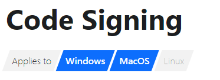

There are plenty of great options available for static site documentation generators, I wouldn't even bother trying to name them all.

The journey to find one that would work for [Velopack](/) was painful and took a few tries.

<!-- truncate -->

## Docfx
Since we started out as a `C#` library, it made sense to start with `docfx`, which was appealing because if you just need to launch a documentation site as quickly as possible for a C# project, it seems to work well. The design is nothing to be proud of, but it's functional.

You can compile `.csproj` files to the corresponding docfx metadata (`.yml`), merge your extra markdown (`.md) and output a static website in one command, and they even have [handy instructions on their homepage](https://dotnet.github.io/docfx/#publish-to-github-pages) on how to publish this to a Github Pages site.

Beyond the basics is where things started to get rough. We built the [Velopack marketing site](https://velopack.io), I wanted to merge the two sites together, but I spent many hours pulling our my hair getting docfx to work with relative url's that live in parent directories `../../the-website` for example. The solution I went with was in the website build script, copy all the files needed into the docfx project, build the site, and then copy the compiled assets back out. Far from elegant. 

Also, good luck actually testing and seeing how anything looks - because there's no `watch` or `hmr` functionality built in, and compile times even for a small project could be as much as 10-20s. You need your own build scripts (eg. gulp) with watch built in you want to get any real work done.

The next problem was styling. I wanted the documentation site to match the style of the marketing site, which I thought wouldn't be hard since they both used Bootstrap 5 (in fact, I picked Bootstrap 5 for the marketing site for this exact reason!). To get anything done, I needed to eject most of the underlying template files (which are handlebar based) and edit them directly. Since the template was already pre-compiled, the css it took to wrangle it into a good looking state was not "easy" per say, but bootstrap is fairly clean. 

This site served us for a while. The design was okay (not great) and the built-in search was sub-par, but it worked for a month before I outgrew it and gave up. Velopack was expanding to support other programming langauges (Rust, C++, JS, etc) and became a multi-repo project. 

The promise of `one command -> get doc site` was nowhere in sight. My build script for docfx was hundreds of lines long, copying files every which way, and in the end there were still crucial parts of the site I just could not alter or hook in to.

:::note[tl;dr;]
Docfx is great for C# project, that needs the most basic documentation with no styling or extensibility. The moment you need anything more than the default template, you should look elsewhere and I'm sorry I didn't do that earlier.
:::

## Nextra
I am a fan of React and next.js, and so when I found a static site documentation engine built on both, I was over the moon. It was easy to get up and running, copy all my markdown in, even add inline React components to my markdown using `mdx`. 

This time I wasn't going to get burned though, I was going to test everything I needed up front.

Out of the gate, TypeScript support was mixed, this wasn't a deal breaker for me. It needs to be set up manually, and some files just need to be `.js` or it won't work.

Dev server / HMR worked well to start with, but the build to static files is where things got hairier. Nextra is built as a JS SPA, and designed to deploy to Vercel or Netlify. There is an option to `output: "export"` your site to static files, this is the only way it will actually emit `.html` files, but with this option enabled the development server stops working. It also disables image optimisation and SPA/JS style navigation. Not an insurmountable problem but definitely an inconvenience for both me and my users.

The final problem which caused everything to fall apart was the styling. I'm by no means a designer, but I am a stickler for consistency. I wanted the background of the Nextra site to match that of the Velopack marketing site. Surely this would be an easy change.

It turns out changing the background just can't really be done. As is sometimes the case with React websites, the css class structure becomes totally incomprehensible, so writing manual css classes was out of the picture, and there was no setting or variable to override anywhere. Judging by some of the issues (eg. [#2185](https://github.com/shuding/nextra/discussions/2185), [#788](https://github.com/shuding/nextra/issues/788), [#2122](https://github.com/shuding/nextra/issues/2122), and so on) this was not just a "me being thick" problem.

:::note[tl;dr;]
Nextra is better, you get HMR, the site out of the box looks great, but deployment and styling options are limited.
:::

## Docusaurus
Since this was so much of an issue with Nextra, this time I started with styling and building.

Starting with Docusaurus ended up being much easier than the others. This was the only command I needed to scaffold the project with full TypeScript support.

```cmd
npx create-docusaurus@latest my-docs-site-name classic --typescript
```

Styling came just as easy, the template had a custom css file all ready for me to add styles, there were examples on the docs and plenty of css variables to edit out of the box. In just a handful of minutes I had it styled the way I wanted, something that took hours or days on the previous attempts.

I was pleasantly suprised when it got time to compile the project. When I ran `npm run build`, docuaurus exported my site structure to pure html/css and also preserved JS/SPA nav. The way it worked is clever, Say you had the files `intro.md` and `guide.md`, it will generate html files for both of these so a static file server (like GitHub Actions) will also serve the files correctly. Once the page has loaded, following links will use JS/SPA style nav avoiding page re-loads. It's really slick.

At this point I was sold. I started moving all my markdown into my docusarus project. 

For compiling references for language libraries, I had to use several strategies:
 - C# using `docfx metadata` and `dfmg` to convert xmldoc to markdown
 - JS using [TypeDoc](https://typedoc.org/)
 - C++ using doxygen followed by moxygen to convert C++ headers to markdown
 - For Rust, I didn't bother, since the [default docs.rs](https://docs.rs/velopack) page was good already.

Everything just worked perfectly. It was easy to start embedding custom React components into the docs too. Each Velopack docs page has an indicator at the top showing what operating systems are supported. In previous iterations this was just text, but in Docusarus it was easy to spruce up:



This was super simple. Just create a `src/components/AppliesTo.tsx`, and I also wrapped MDXComponents so I my component was pre-loaded (eg. did not need to `import` it at the top of the markdown page):

```tsx title="/src/theme/MDXComponents.js"
import MDXComponents from '@theme-original/MDXComponents';
import AppliesTo from '@site/src/components/AppliesTo';

export default {
    ...MDXComponents,
    AppliesTo,
};
```

And then in each markdown file I can just add the component directly, for example:
```md title="/docs/MyPage.md"
# My Page Title
<AppliesTo win mac />
This page applies to only windows and mac...
```

In the end, I can't recommend Docusaurus enough. It is extremely easy to use/get started, and provides plenty of extensibility in all areas. 

And the fact that it comes out of the box with a Blog is the reason I'm writing this post!