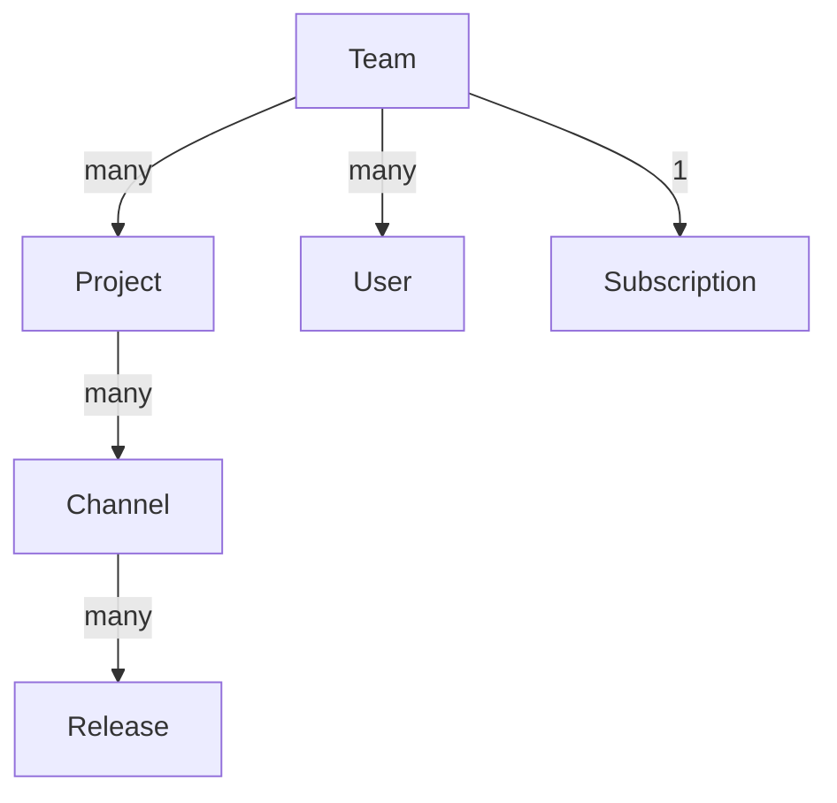

# Velopack Flow Overview
<AppliesTo all />

<FlowLink text="Flow" /> is Velopack's hosted solution for distributing applications. It provides a seamless way to distribute your Velopack applications. If you would prefer to self-host your application and manually manage infrastructure, updates, and rollbacks, see the [self-hosting](../self-hosting.mdx) section.

## Pricing
Velopack Flow offers a free tier so that you can get started without any upfront costs. The free tier allows you to create a small number of projects in a single free tier team, and limits the amount of storage and bandwidth that can be consumed per-month. You can increase these by upgrading to a paid plan. For pricing and details see the pricing page within your <FlowLink text="team" suffix="teams" />. Though you can be a member of many teams, you will only be able to create Projects in a single Free tier team.

Subscriptions for <FlowLink /> are per-team. This means that the subscription is tied to the team not an individual user. When you first create an account, you will have a default team created for you (see <FlowLink text="teams page" suffix="teams" />). You can create additional teams or rename this team at any time. From the team page, you can select Billing to see your current plan as well as pricing options for paid plans.

## Data Structure
A basic overview of the data structure used by <FlowLink /> is as follows:

The [pricing model](#pricing) is linked to a team. Though a user can be a member of many teams, a user will only be able to create projects in a single free tier team (a team without a paid subscription). A team contains projects. A project refers to a single application, more specificially a single package id. A project can have many channels, which are used to organize releases. A channel is a logical grouping of releases, such as "stable", "beta", or "alpha". Channels should also be used to separate different platforms such as "Windows", "macOS" and "Linux". Within a channel, a release is made up of one ore more artifacts (the files created by running `vpk pack`), which are the files distributed to your end users. For a release to be considered valid it must contain at least the full release package as well as the corresponding Setup.exe file. 
