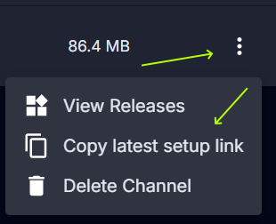

# Static Links
<FlowLink /> provides static links for each channel, and release. These links can be referred from your own website to direct user to download the latest release of an application, or to download a specific release. 

The most common will be the latest release for a given channel. On the channel list page you can click the ellipsis menu on the right side of the channel row and select "Copy latest setup link". This will copy a link to the latest setup installer for that channel to your clipboard. This URL will always point to the latest release for that channel, so you can use it in your own website or documentation.

You can also get direct link to specific releases. On the release details page there is a Release links section with buttons to copy links to installers at specific versions. 

For more advanced use cases see the `download/*` endpoints under the Releases section from [API](./api.mdx). The API provides additional functionality to get links to specific artifacts or artifact types.
