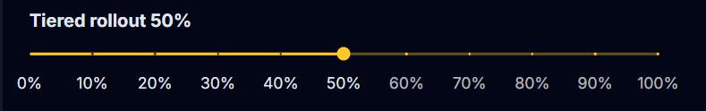

# Tiered Rollout
Tiered rollout is a feature of <FlowLink /> that allows you to gradually release a new version of your application to a subset of users. This is useful for testing new features or changes before rolling them out to all users. You can specify a rough percentage of users that should receive the new version by adjusting the slider on the release details page for a given release. 

When a user installs a Velopack application they are given a random ID. When the `UpdateManager` queries for updates, this ID is passed to the Flow service. To determine if a user should receive the new version of the application, the Flow service hashes this ID and checks if it falls within the percentage range specified for the release. If it does, the user will receive the new version of the application.

