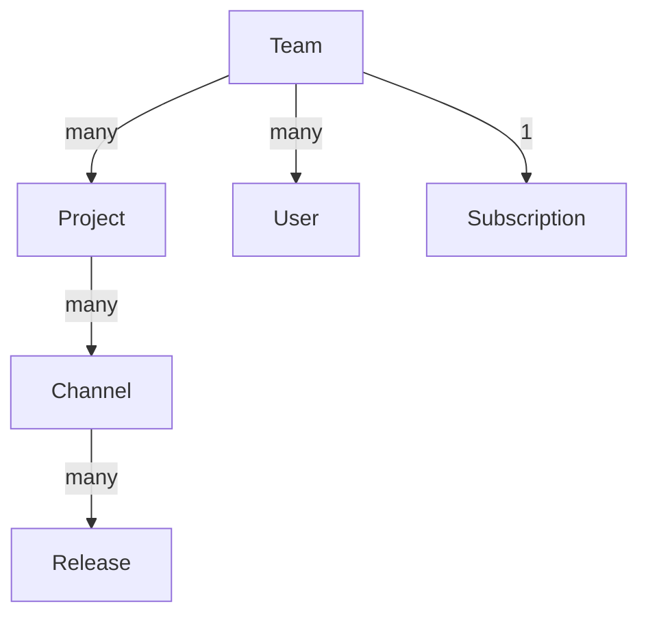

# Resumen de Velopack Flow
<AppliesTo all />

<FlowLink text="Flow" /> es la solución alojada de Velopack para distribuir aplicaciones. Ofrece una forma fluida de distribuir tus aplicaciones de Velopack. Si prefieres alojar tu aplicación por tu cuenta y gestionar manualmente la infraestructura, las actualizaciones y las reversiones, consulta la sección de [autoalojamiento](../self-hosting.mdx).

## Precios {#pricing}
Velopack Flow ofrece un nivel gratuito para que puedas empezar sin costos iniciales. El nivel gratuito te permite crear un pequeño número de proyectos en un único equipo de nivel gratuito, y limita la cantidad de almacenamiento y ancho de banda que puede consumirse al mes. Puedes aumentar estos límites actualizando a un plan de pago. Para conocer los precios y detalles, consulta la página de precios dentro de tus <FlowLink text="team" suffix="teams" />. Aunque puedes ser miembro de muchos equipos, solo podrás crear Proyectos en un único equipo de nivel gratuito.

Las suscripciones de <FlowLink /> son por equipo. Esto significa que la suscripción está vinculada al equipo y no a un usuario individual. Cuando creas una cuenta por primera vez, se crea un equipo predeterminado para ti (consulta la <FlowLink text="teams page" suffix="teams" />). Puedes crear equipos adicionales o renombrar este equipo en cualquier momento. Desde la página del equipo, puedes seleccionar Billing para ver tu plan actual, así como las opciones de precios de los planes de pago.

## Estructura de datos
Una descripción básica de la estructura de datos utilizada por <FlowLink /> es la siguiente:

El [modelo de precios](#pricing) está vinculado a un equipo. Aunque un usuario puede ser miembro de muchos equipos, un usuario solo podrá crear proyectos en un único equipo de nivel gratuito (un equipo sin una suscripción de pago). Un equipo contiene proyectos. Un proyecto se refiere a una sola aplicación, más concretamente a un único package id. Un proyecto puede tener muchos canales, que se utilizan para organizar las versiones. Un canal es una agrupación lógica de versiones, como "stable", "beta" o "alpha". Los canales también deben usarse para separar diferentes plataformas como "Windows", "macOS" y "Linux". Dentro de un canal, una versión se compone de uno o más artefactos (los archivos creados al ejecutar `vpk pack`), que son los archivos distribuidos a tus usuarios finales. Para que una versión se considere válida, debe contener al menos el paquete de versión completo, así como el archivo Setup.exe correspondiente. 
